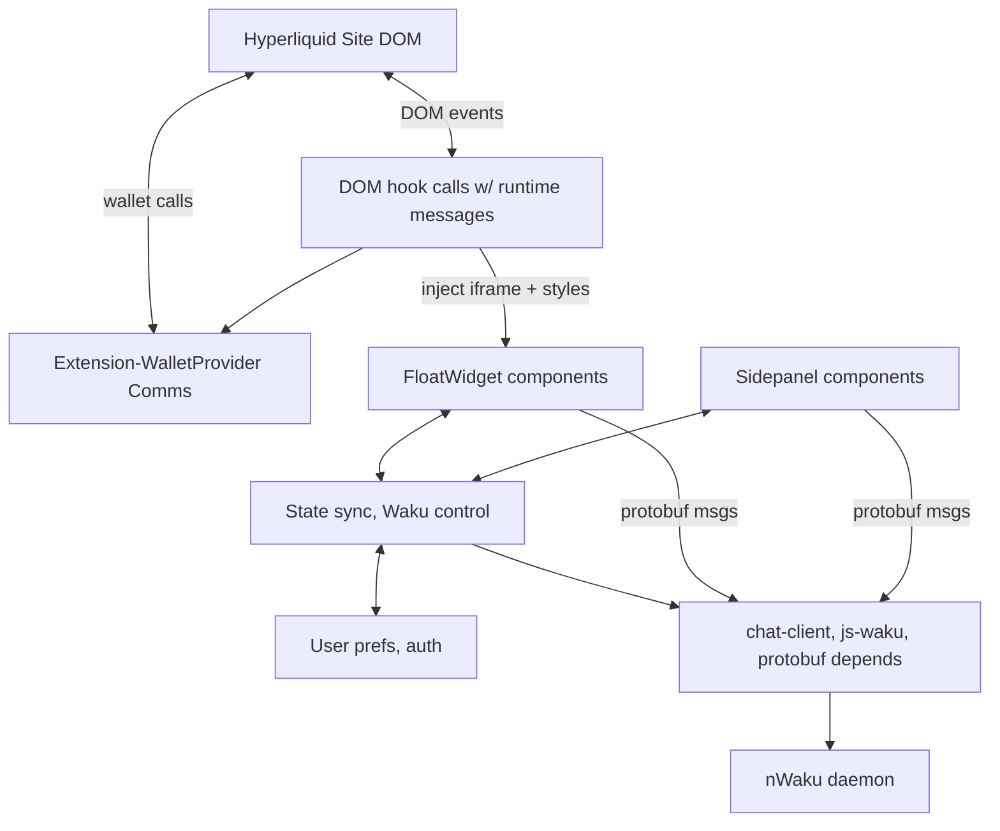

# Hyperchat Message Flow

MV3 extension bundle exchanges data between browser contexts, injected UI elements, & bundled Waku/protobuf libraries.

```mermaid
flowchart TD
  hyperliquid["Hyperliquid Site DOM"]
  contentScript["DOM hook calls w/ runtime messages"]
  walletBridge["Extension-WalletProvider Comms"]
  chatWidget["FloatWidget components"]
  sidePanel["Sidepanel components"]
  background["State sync, Waku control"]
  storage["User prefs, auth"]
  wakuLibs["chat-client, js-waku, protobuf depends"]
  wakuNetwork["nWaku daemon"]

  hyperliquid <-->|DOM events| contentScript
  hyperliquid <-->|wallet calls| walletBridge
  contentScript -->|inject iframe + styles| chatWidget
  contentScript --> walletBridge
  chatWidget <--> background
  sidePanel <--> background

  background <--> storage
  background --> wakuLibs
  wakuLibs --> wakuNetwork
  chatWidget -->|protobuf msgs| wakuLibs
  sidePanel -->|protobuf msgs| wakuLibs
```
